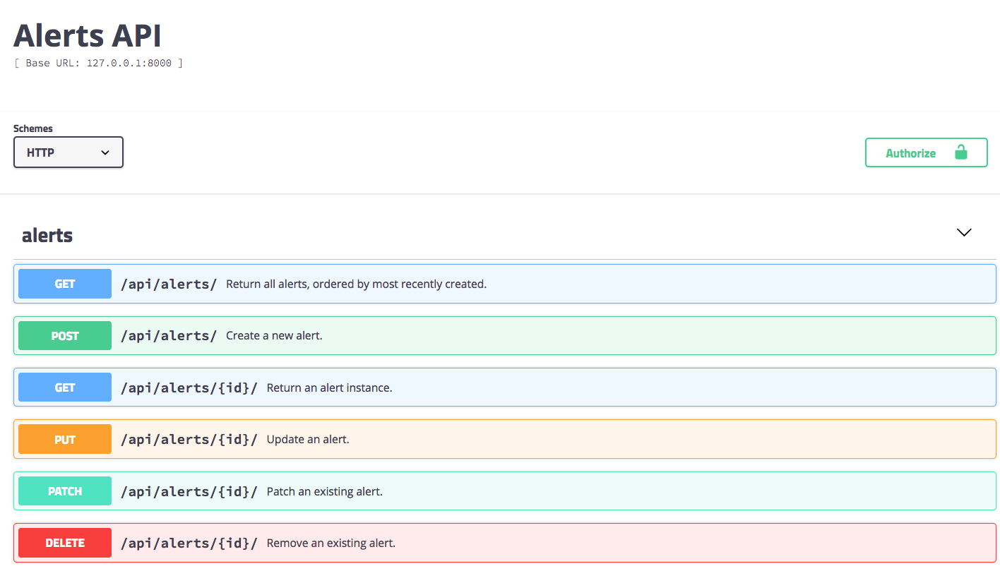

# Ebay Alert Codechallenge

A service to manage alerts for products prices on Ebay.com; the service
will allow a user to create an alert so he can receive updates about
specific products search phrase delivered to his email address.

Through this solution a user can create an alert by providing a search
phrase, email address and one of the values (2 minutes, 10 minute or 30
minutes) that specify how often he will receive the updates.

User will then obtain the first 20 products sorted by the lowest price
every 2, 10 or 30 minutes delivered to his email address.

## Setup and Running

Either use docker and run ``docker-compose up`` (this will create two containers, web_1 and db_1).

Alternatively, install dependencies on your own machine and run locally:

    virtualenv .
    source bin/activate
    pip3 install -r requirements.txt
    python manage.py migrate
    python manage.py runserver

In either case you can then connect to ``http://127.0.0.1:8000``.

### Exploring the API
To explore the API use swagger at the url ``/swagger``, so go to
``http://127.0.0.1:8000/swagger``.

To create new alerts via the REST API, in swagger click on "alerts", "POST /api/alerts/ Create a new alert.", then "Try it out"

## Testing

Run ``python manage.py test`` to run all the tests. Alternatively, install ``coverage`` and run ``coverage run manage.py test`` to check for code coverage...
