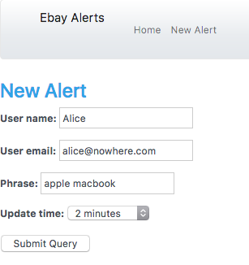
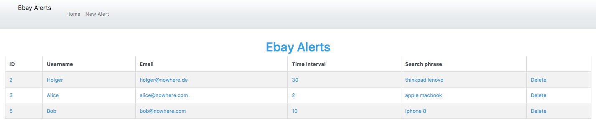
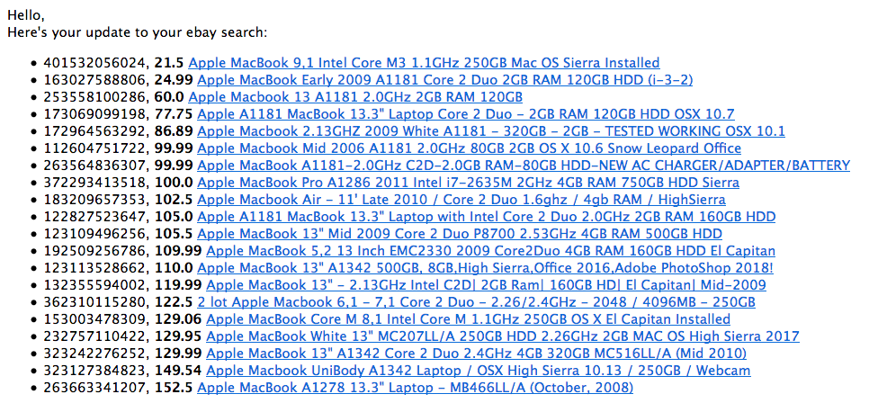

# Ebay Alert 

A service to manage alerts for products prices on Ebay.com; the service
will allow a user to create an alert so he can receive updates about
specific products search phrase delivered to his email address.

Through this solution a user can create an alert by providing a search
phrase, email address and one of the values (2 minutes, 10 minute or 30
minutes) that specify how often he will receive the updates.

User will then obtain the first 20 products sorted by the lowest price
every 2, 10 or 30 minutes delivered to his email address.

## Setup and Running

Either use docker and run ``docker-compose up`` (this will create two containers, web_1 and db_1).

Alternatively, install dependencies on your own machine and run locally:

    virtualenv .
    source bin/activate
    pip3 install -r requirements.txt
    python manage.py migrate
    python manage.py runserver

In either case you can then connect to ``http://127.0.0.1:8000``.

You should see an empty list, which you can populate by clicking on ''New Alert'':

This is how list looks like populated with some alerts:

### Exploring the API
To explore the API use swagger at the url ``/swagger``, so go to
``http://127.0.0.1:8000/swagger``.

To create new alerts via the REST API, in swagger click on "alerts", "POST /api/alerts/ Create a new alert.", then "Try it out"

Alternatively here's a list of REST urls you can try:

#### List of all Alerts:
You can GET all alerts by accessing the url ``/api/alerts``

Example:

    curl -X GET "http://127.0.0.1:8000/api/alerts/" 

Example response:

    [
      {
        "user_name": "Holger",
        "user_email": "holger@nowhere.de",
        "update_time": "30",
        "phrase": "thinkpad lenovo"
      },
      {
        "user_name": "Alice",
        "user_email": "alice@nowhere.com",
        "update_time": "2",
        "phrase": "apple macbook"
      },
      {
        "user_name": "Bob",
        "user_email": "bob@nowhere.com",
        "update_time": "10",
        "phrase": "iphone 8"
      },
      {
        "user_name": "Chris",
        "user_email": "chris@nowhere.com",
        "update_time": "30",
        "phrase": "Asus monitor"
      }
    ]

#### GET an individual alert
An individual alert can be retrieved by appending its primary key to the url, like so: ``/api/alerts/3/``

Example:

    curl -X GET "http://127.0.0.1:8000/api/alerts/3/" 

Example response:

    {
    "user_name": "Alice",
    "user_email": "alice@nowhere.com",
    "update_time": "2",
    "phrase": "apple macbook"
    }"

#### Creating a new alert
To add an alert, you need to POST to the url ``alerts/api``.

Example:
    
    curl -X POST "http://127.0.0.1:8000/api/alerts/" -d "{  \"user_name\": \"David\",  \"user_email\": \"david@nowhere.com\",  \"update_time\": \"30\",  \"phrase\": \"slingshot\"}"

Example response:

    {
    "user_name": "David",
    "user_email": "david@nowhere.com",
    "update_time": "30",
    "phrase": "slingshot"
    }

## Running the ebay searches

To actually search ebay for the search phrases, you first need to define some variables in the ``settings.py`` file:

    EMAIL_HOST = 'your email provider`s` smtp host'
    EMAIL_PORT = 'the smtp port'
    EMAIL_HOST_USER = 'your username at the email provider'
    EMAIL_HOST_PASSWORD = 'your password to log into the email provider'

Then you can run the management command ``send_emails``:

    python manage.py send_emails

Ideally, you enter this command into your crontab like so:

    * * * * * /path/to/python /path/to/the/project/manage.py send_emails

This will check every minute if there are ebay searches to be done and perform these and send an email to each user with the search results.

## Testing

Run ``python manage.py test`` to run all the tests. Alternatively, install ``coverage`` and run ``coverage run manage.py test`` to check for code coverage...
